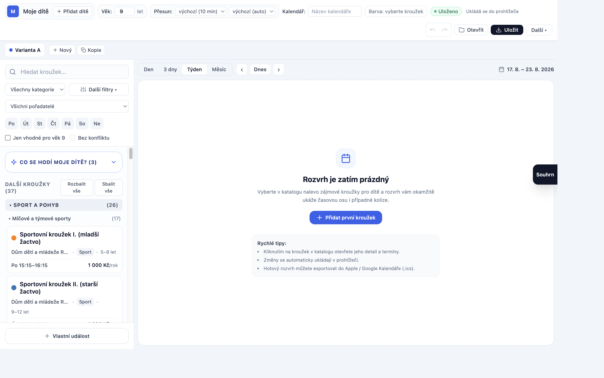
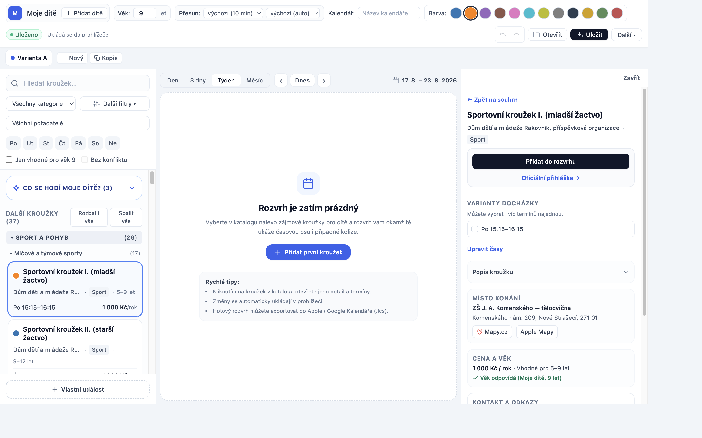
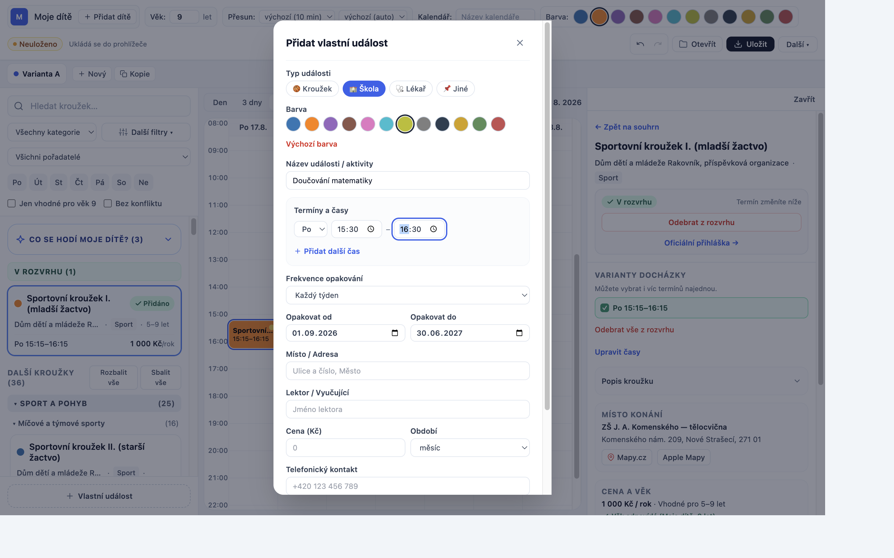
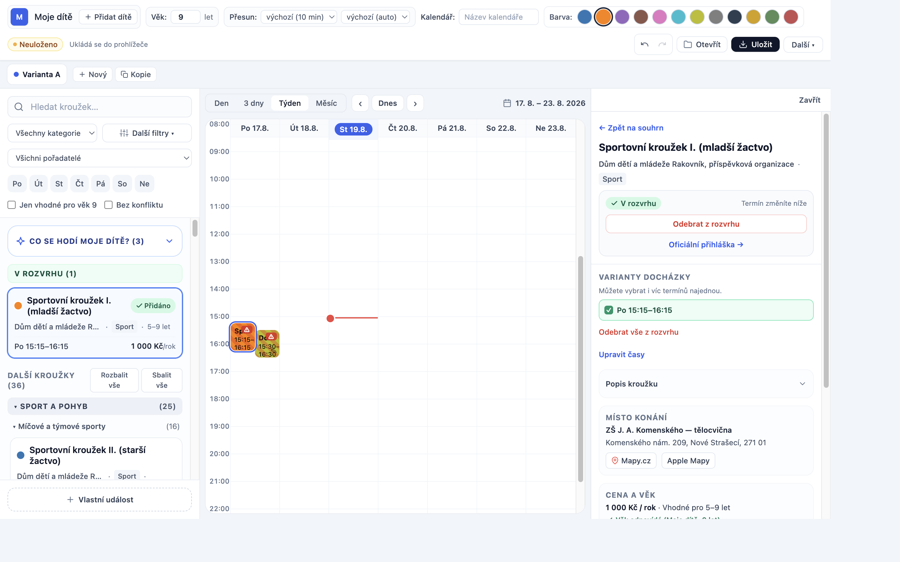
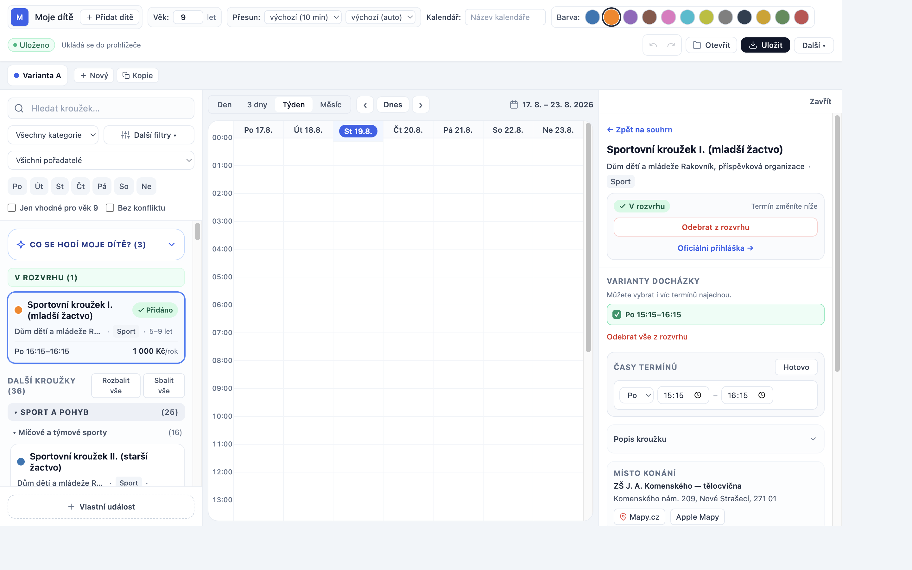
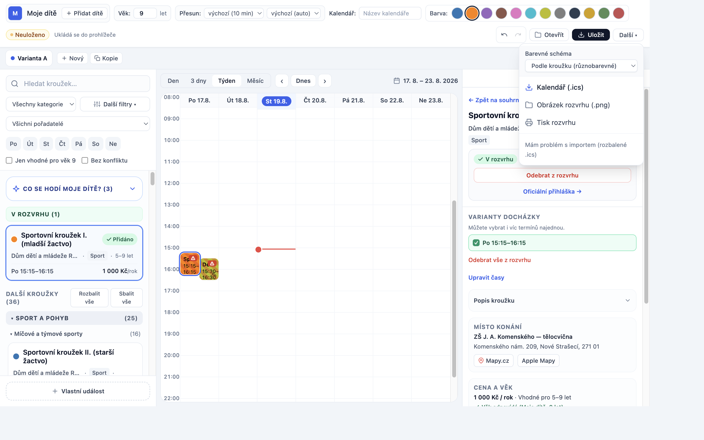
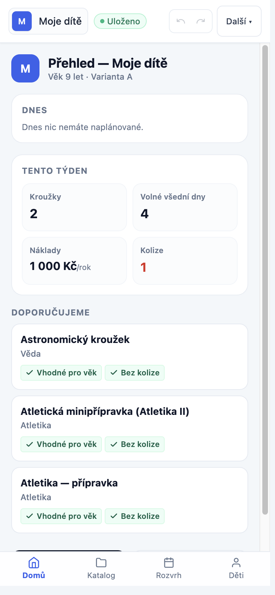

# Návod k použití — Krouzky Planner

Jednoduchý průvodce pro rodiče: jak si za pár minut poskládat týdenní rozvrh
kroužků pro dítě, vidět případné kolize a rozvrh si vyexportovat do kalendáře
v telefonu.

> **Vše zůstává jen ve vašem prohlížeči.** Nic se neodesílá na žádný server —
> rozvrh se automaticky ukládá do paměti prohlížeče a kdykoliv si ho můžete
> stáhnout jako soubor nebo otevřít na jiném počítači.

---

## 1. Úvodní obrazovka

Aplikace má tři sloupce: **katalog kroužků** vlevo, **rozvrh dítěte**
uprostřed a **informační panel** vpravo (na mobilu se přepínáte mezi nimi
záložkami dole).

- Vlevo nahoře vidíte jméno dítěte a jeho věk — podle věku se v katalogu
  rovnou barevně označí, které kroužky jsou pro něj vhodné.
- Prostřední sloupec je zatím prázdný — jakmile přidáte první kroužek,
  objeví se tu jako barevný blok v týdenní mřížce.
- Vpravo je souhrn týdne (kolik kroužků, kolik to stojí, kolik zbývá volných
  dnů).

---

## 2. Najít a otevřít kroužek

Klikněte na kterýkoliv kroužek v katalogu vlevo — otevře se jeho detail
vpravo s časem, cenou, místem konání a kontaktem na pořadatele.

**Tip:** Nahoře v katalogu můžete kroužky filtrovat — podle kategorie, dne v
týdnu, ceny nebo přepínačem **„Bez konfliktu“**, který schová vše, co by se
překrývalo s tím, co už dítě má v rozvrhu.

## 3. Přidat kroužek do rozvrhu

V detailu klikněte na **„Přidat do rozvrhu“**. Pokud má kroužek víc
možných termínů (např. pondělí i středa), vyberte si nejdřív ten, který vám
vyhovuje — jde vybrat i víc termínů najednou.

Kroužek se hned objeví jako barevný blok v týdenní mřížce a v levém sloupci
přibude do sekce **„V rozvrhu“**. Kliknutím na blok v mřížce nebo na kartu
vlevo se kdykoliv vrátíte k jeho detailu.

---

## 4. Vlastní události (škola, lékař, doučování…)

Rozvrh nemusí obsahovat jen kroužky z katalogu. Tlačítkem **„+ Vlastní
událost“** dole v katalogu přidáte cokoliv dalšího — doučování, návštěvu u
lékaře, kroužek, který v katalogu není, nebo cokoliv jiného.

U vlastní události zvolíte:
- **Typ** (Kroužek / Škola / Lékař / Jiné) — podle typu se automaticky
  nabídne vhodná barva, kterou si ale můžete i sami změnit.
- **Den a čas**, případně víc termínů tlačítkem „Přidat další čas“.
- Volitelně místo, cenu, lektora a poznámku.

## 5. Kolize v rozvrhu

Pokud se dva termíny časově překrývají, oba dostanou v mřížce červený
výstražný trojúhelník ⚠ a při najetí myší uvidíte, se kterou událostí
kolidují.

Kolize aplikace nikdy sama neřeší — jen na ni upozorní, rozhodnutí (např.
odebrat jeden z termínů) je vždy na vás.

---

## 6. Katalog nemusí být aktuální — upravte si údaje

Data v katalogu se mohou v čase změnit (jiný čas tréninku, jiná cena…). U
každého kroužku ve svém rozvrhu si můžete údaje přepsat — beze změny
katalogu, jen pro sebe:

- **„Upravit časy“** — změníte den v týdnu i čas začátku/konce termínu.
- **„Upravit údaje“** — změníte název, adresu, telefon nebo cenu.
- **„Barva kroužku“** — vlastní barva bloku v mřížce.
- **„Povolit i o prázdninách a státních svátcích“** — kroužky se ve
  výchozím stavu o prázdninách a svátcích v mřížce nezobrazují; tímto
  přepínačem to pro konkrétní kroužek povolíte.

Cokoliv upravené nese v aplikaci žlutou značku „upraveno vámi“ a jde to
kdykoliv vrátit tlačítkem **„Obnovit“**/**„Obnovit z katalogu“**.

---

## 7. Export do kalendáře v telefonu / počítači

Tlačítkem **„Další ▾“** v horní liště otevřete nabídku exportu.

- **„Kalendář (.ics)“** — stáhne soubor, který stačí otevřít a rozvrh se
  přidá do Apple Kalendáře, Google Kalendáře nebo Outlooku i s
  připomínkami.
- **„Obrázek rozvrhu (.png)“** — obrázek pro vytištění nebo poslání někomu
  jinému.
- **„Tisk rozvrhu“** — rovnou vytiskne aktuální týden.

## 8. Uložit a otevřít rozvrh

Vlevo nahoře v liště jsou tlačítka **„Uložit“** a **„Otevřít“** — rozvrh si
uložíte jako soubor (a třeba ho pošlete druhému rodiči) a kdykoliv ho zase
načtete zpět. Rozvrh se navíc průběžně sám ukládá do prohlížeče, takže po
zavření okna nic nezmizí.

---

## 9. Mobilní telefon

Na užší obrazovce (telefon, malý tablet) aplikace přepne na dolní
navigaci se čtyřmi záložkami: **Domů**, **Katalog**, **Rozvrh**, **Děti**.

Záložka **Domů** ukazuje, co má dítě dnes a tento týden, souhrn nákladů a
kolizí a pár tipů na kroužky, které by dítěti mohly sedět.

---

## Shrnutí — nejrychlejší cesta k hotovému rozvrhu

1. Zkontrolujte věk dítěte nahoře v liště.
2. V katalogu si vyfiltrujte kroužky (kategorie, den, „Bez konfliktu“).
3. Klikněte na kroužek → **„Přidat do rozvrhu“**.
4. Doplňte školu/lékaře/doučování přes **„+ Vlastní událost“**.
5. Zkontrolujte, jestli mřížka nehlásí kolize ⚠.
6. **„Další ▾“ → „Kalendář (.ics)“** — a rozvrh máte v telefonu.
